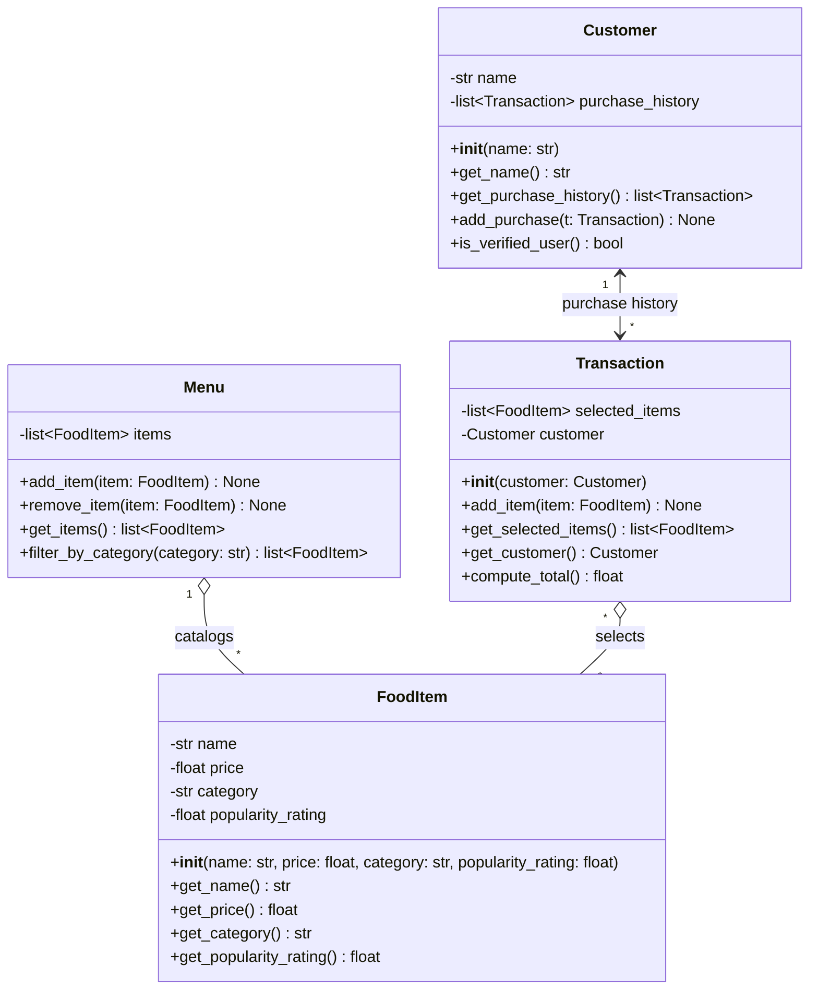

# ByteBites — UML Design Diagram

## Relationship Notes

- **Customer ↔ Transaction** — one bidirectional association replaces the two
  separate arrows in the draft. A `Customer` owns many `Transaction`s
  (`purchase_history`) and each `Transaction` knows its `Customer`.
- **Menu ◇— FoodItem** — aggregation: the `Menu` catalogs many `FoodItem`s, but
  items exist independently of any single menu.
- **Transaction ◇— FoodItem** — aggregation: a `FoodItem` can appear in many
  transactions, and the same item can be selected across customers (`*..*`).
